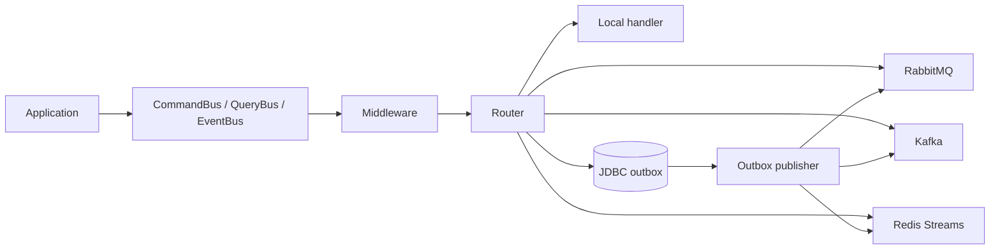

<div align="center">

# Spring Application Messenger

**A lightweight, Spring-native message bus for commands, queries, and events.**

[](#project-status)
[](#requirements)
[](#requirements)
[](https://corentinguerrero.github.io/spring-application-messenger/)

[Documentation](https://corentinguerrero.github.io/spring-application-messenger/) ·
[Example application](spring-messenger-example) ·
[Connector guides](https://corentinguerrero.github.io/spring-application-messenger/#connectors)

</div>

Spring Application Messenger gives Spring Boot applications one API for synchronous handlers and progressively asynchronous messaging. Start in-process, then route selected commands or events through RabbitMQ, Kafka, Redis Streams, or a transactional JDBC outbox without changing application handlers.

It is inspired by Symfony Messenger, while deliberately staying smaller and focused on application messaging. It is not an event-sourcing framework, workflow engine, or replacement for Spring Integration.

## At a Glance

- `CommandBus` dispatches an intention to change state to exactly one handler.
- `QueryBus` asks for data synchronously from exactly one handler.
- `EventBus` publishes a fact to zero, one, or many handlers.
- Spring discovers annotated handlers and validates them at startup.
- Middleware handles validation, transactions, logging, authorization, and observability concerns.
- Routing selects local execution, a broker, or the JDBC outbox by message type.
- Consumers deserialize transport messages and invoke the same application handlers.



## Requirements

- Java 21 or newer
- Spring Boot 3.5.x
- Gradle for the current source build

The artifacts are not published to Maven Central yet. The coordinates below describe the planned `0.1.0` release; inside this repository, modules are consumed as Gradle projects.

## Installation

Add the starter, then only the transport modules used by the application:

```groovy
dependencies {
    implementation "io.github.applicationmessenger:spring-application-messenger-starter:0.1.0"

    // Optional
    implementation "io.github.applicationmessenger:messenger-transport-rabbitmq:0.1.0"
    implementation "io.github.applicationmessenger:messenger-transport-kafka:0.1.0"
    implementation "io.github.applicationmessenger:messenger-transport-redis:0.1.0"
    implementation "io.github.applicationmessenger:messenger-transport-jdbc-outbox:0.1.0"
}
```

## Quick Start

Define a command:

```java
public record RegisterUser(String email) implements Command<UserId> {
}
```

Create a regular Spring handler:

```java
@CommandHandler
public class RegisterUserHandler {
    private final UserRepository repository;
    private final EventBus eventBus;

    public RegisterUserHandler(UserRepository repository, EventBus eventBus) {
        this.repository = repository;
        this.eventBus = eventBus;
    }

    public UserId handle(RegisterUser command) {
        User user = User.register(command.email());
        repository.save(user);
        eventBus.publish(new UserRegistered(user.id(), user.email()));
        return user.id();
    }
}
```

Dispatch it from application code:

```java
UserId userId = commandBus.dispatch(new RegisterUser("john@example.com"));
```

Queries use `queryBus.ask(query)`. Events use `eventBus.publish(event)`.

## Routing

Queries always remain synchronous and in-process. Commands and events can be routed by simple or fully qualified class name:

```yaml
messenger:
  default-transport: sync
  validation:
    enabled: true
  routing:
    commands:
      SendWelcomeEmail: rabbitmq
      RebuildUserSearchIndex: kafka
    events:
      UserRegistered: pg-outbox
```

Each transport has its own configuration and consumer options. See the dedicated guides rather than copying production settings from a generic example.

## Connectors

| Connector | Producer | Consumer | Documentation |
| --- | --- | --- | --- |
| Sync | In-process dispatch | Local Spring handler | [Overview](https://corentinguerrero.github.io/spring-application-messenger/#routing) |
| RabbitMQ | Spring AMQP publisher | Managed queue listener | [RabbitMQ](https://corentinguerrero.github.io/spring-application-messenger/plugins/rabbitmq.html) |
| Kafka / Redpanda | Spring Kafka producer | Managed topic listener | [Kafka](https://corentinguerrero.github.io/spring-application-messenger/plugins/kafka.html) |
| Redis Streams | Stream publisher | Managed consumer-group listener | [Redis Streams](https://corentinguerrero.github.io/spring-application-messenger/plugins/redis.html) |
| JDBC Outbox | Transactional database insert | Scheduled outbox publisher | [JDBC Outbox](https://corentinguerrero.github.io/spring-application-messenger/plugins/jdbc-outbox.html) |

Broker connectivity, including Kafka SSL/SASL and RabbitMQ credentials, is configured through the standard Spring Boot properties.

## Testing

The `messenger-test` module provides fake buses, a recording event bus, assertions, and handler helpers:

```groovy
dependencies {
    testImplementation "io.github.applicationmessenger:messenger-test:0.1.0"
}
```

```java
RecordingEventBus eventBus = new RecordingEventBus();
RegisterUserHandler handler = new RegisterUserHandler(repository, eventBus);

handler.handle(new RegisterUser("john@example.com"));

assertThat(eventBus).hasPublished(UserRegistered.class);
```

The repository test suite includes Testcontainers coverage for PostgreSQL, RabbitMQ, Kafka/Redpanda, and Redis. Container tests run when Docker is available.

```bash
./gradlew test
```

## Example Application

[`spring-messenger-example`](spring-messenger-example) is a runnable Spring Boot application demonstrating:

- synchronous command and query handlers
- Bean Validation
- transactional JDBC outbox persistence and publishing
- RabbitMQ command production and consumption
- Kafka/Redpanda command production and consumption
- PostgreSQL and broker integration tests with Testcontainers

```bash
./gradlew :spring-messenger-example:bootRun
```

Its single [`application.yml`](spring-messenger-example/src/main/resources/application.yml) shows the complete routing and transport configuration without Spring profiles.

## Modules

| Module | Purpose |
| --- | --- |
| `messenger-core` | Public bus API, dispatch, routing, middleware, metadata, and transport SPI |
| `messenger-spring` | Handler annotations and Spring bean discovery |
| `messenger-spring-boot-starter` | Auto-configuration, properties, sync transport, and validation |
| `messenger-transport-rabbitmq` | RabbitMQ producer and consumer |
| `messenger-transport-kafka` | Kafka producer and consumer |
| `messenger-transport-redis` | Redis Streams producer and managed listener |
| `messenger-transport-jdbc-outbox` | JDBC outbox storage and publisher |
| `messenger-test` | Reusable application testing utilities |
| `spring-messenger-example` | Complete runnable example |

## Project Status

Current version: `0.1.0-SNAPSHOT`.

The core buses, handler discovery, middleware, validation, routing, transports, consumers, outbox publisher, test utilities, and integration tests are implemented. Before a stable `1.0`, the main remaining areas are Maven Central publication, customizable serialization, consistent retry/DLQ policies, and Micrometer/OpenTelemetry integration.

The public API and transport SPI are covered by contract tests, but the project is still pre-release and may evolve before `1.0`.

## Documentation

The complete documentation contains configuration references, connector examples, consumer behavior, transport format, outbox lifecycle, testing guides, and known limitations:

**[Open the documentation](https://corentinguerrero.github.io/spring-application-messenger/)**

The static site source lives in [`docs/`](docs) and is published directly through GitHub Pages.
