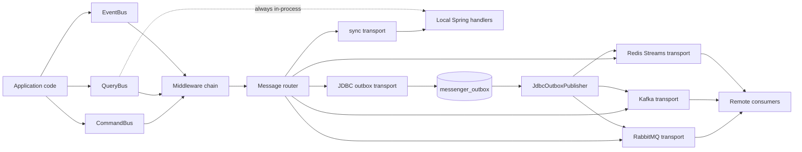
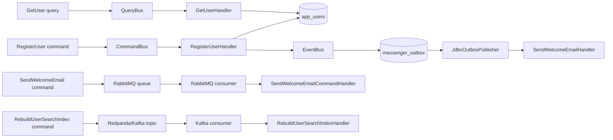
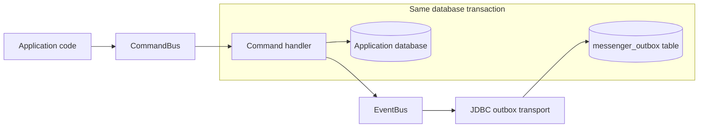
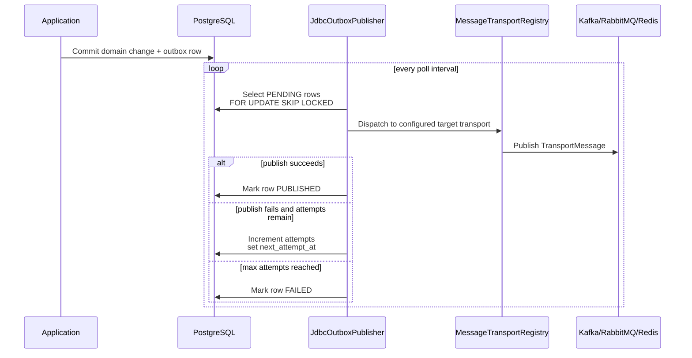
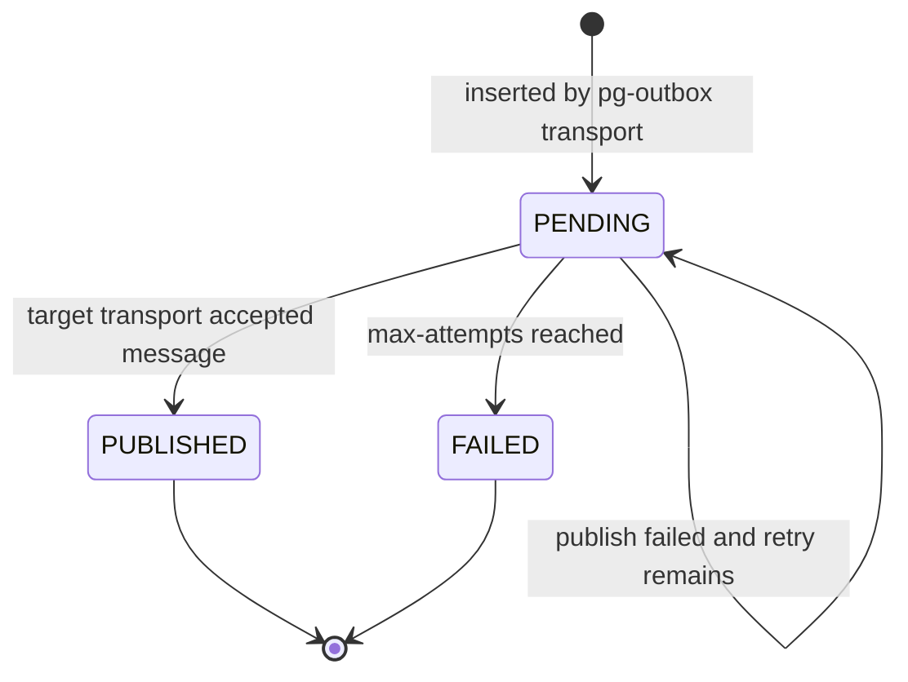

# Spring Application Messenger

Spring Application Messenger is a lightweight Spring Boot library for dispatching application commands, queries, and domain events through a unified API.

It is inspired by Symfony Messenger, while staying deliberately smaller and Spring-native. The goal is to provide a clean in-process bus first, then allow selected messages to be routed to transports such as RabbitMQ, Kafka, Redis Streams, or a JDBC/PostgreSQL outbox without changing application code.

## Architecture Overview



At runtime, application code keeps the same API: `CommandBus`, `QueryBus`, and `EventBus`. Routing decides whether commands and events are handled locally, sent directly to a transport, or first persisted in the JDBC outbox. Queries stay synchronous and in-process by design.

## Status

Current version: `0.1.0-SNAPSHOT`

Implemented:

- `CommandBus`
- `QueryBus`
- `EventBus`
- annotated Spring handlers
- automatic handler discovery
- startup validation for handler signatures
- synchronous in-process dispatch
- middleware chain
- optional Bean Validation middleware
- event error strategies
- routing by message type
- transport SPI
- producer-side transports for RabbitMQ, Kafka, Redis Streams, and JDBC outbox
- consumer-side dispatch for RabbitMQ and Kafka
- managed Redis Streams listener with consumer group ACK
- managed JDBC outbox publisher with retry and final failure status
- `messenger-test` module with fake buses, event recorder, assertions, and handler helpers
- Gradle multi-module build

Not implemented yet:

- DLQ handling
- serialization strategy customization
- Micrometer and tracing integration
- async local executor dispatch

## Requirements

- Java 21 or newer
- Gradle wrapper included
- Spring Boot 3.5.x alignment through the Spring Boot dependency BOM

## Build

```bash
./gradlew test
```

If you already have Gradle installed:

```bash
gradle test
```

The test suite includes Testcontainers integration tests for RabbitMQ, Kafka, Redis, and PostgreSQL. They run automatically when Docker is available and are skipped when Docker is not available.

## GitHub Pages Documentation

The static documentation site lives in `docs/` and can be hosted directly with GitHub Pages.

To publish it:

1. Open the repository settings on GitHub.
2. Go to `Pages`.
3. Set `Source` to `Deploy from a branch`.
4. Select the main branch.
5. Select the `/docs` folder.

The site is static: no build step is required.

## API Stability

The library now separates three surfaces:

- Public API: intended for application code and considered stable for the current minor line.
- SPI: intended for custom transports, routers, registries, and advanced integration code.
- Implementation classes: usable by Spring auto-configuration, but not the preferred extension point.

Stable application API:

```text
io.github.applicationmessenger.messenger.Command<R>
io.github.applicationmessenger.messenger.Query<R>
io.github.applicationmessenger.messenger.Event
io.github.applicationmessenger.messenger.CommandBus
io.github.applicationmessenger.messenger.QueryBus
io.github.applicationmessenger.messenger.EventBus
io.github.applicationmessenger.messenger.envelope.MessageEnvelope
io.github.applicationmessenger.messenger.envelope.MessageMetadata
io.github.applicationmessenger.messenger.middleware.MessageMiddleware
io.github.applicationmessenger.messenger.dispatch.EventErrorStrategy
io.github.applicationmessenger.messenger.transport.TransportNames
```

Stable Spring API:

```text
io.github.applicationmessenger.messenger.spring.CommandHandler
io.github.applicationmessenger.messenger.spring.QueryHandler
io.github.applicationmessenger.messenger.spring.EventHandler
io.github.applicationmessenger.messenger.spring.TransactionalCommandHandler
```

Stable SPI:

```text
io.github.applicationmessenger.messenger.handler.HandlerRegistry
io.github.applicationmessenger.messenger.handler.MessageHandler
io.github.applicationmessenger.messenger.routing.MessageRouter
io.github.applicationmessenger.messenger.routing.MessageRoute
io.github.applicationmessenger.messenger.transport.MessageTransport
io.github.applicationmessenger.messenger.transport.TransportMessage
```

Stable transport names are exposed through `TransportNames`:

```java
TransportNames.SYNC;
TransportNames.RABBITMQ;
TransportNames.KAFKA;
TransportNames.REDIS;
TransportNames.JDBC_OUTBOX;
TransportNames.PG_OUTBOX_ALIAS;
```

The modules include API contract tests that fail when these signatures, enum values, or transport names drift accidentally.

## Modules

| Module | Purpose |
| --- | --- |
| `messenger-core` | Public contracts, envelope, metadata, registry, dispatchers, routing, transport SPI, middleware API, exceptions. |
| `messenger-spring` | Handler annotations and Spring `ApplicationContext` scanning. |
| `messenger-spring-boot-starter` | Spring Boot auto-configuration, configuration properties, default `sync` transport, validation middleware. |
| `messenger-transport-rabbitmq` | Producer-side RabbitMQ transport using `RabbitTemplate`. |
| `messenger-transport-kafka` | Producer-side Kafka transport using `KafkaTemplate<String, Object>`. |
| `messenger-transport-redis` | Producer-side Redis Streams transport using `RedisTemplate<String, Object>`. |
| `messenger-transport-jdbc-outbox` | Producer-side JDBC outbox transport using `JdbcTemplate`. |
| `messenger-test` | Test helpers: fake command/query buses, recording event bus, event assertions, handler invoker. |
| `spring-messenger-example` | Concrete Spring Boot sample application using command, query, and event handlers. |

## Installation

The artifacts are not published yet. In a local multi-project setup, depend on the modules you need.

For a future published release, a typical application would use:

```groovy
dependencies {
    implementation 'io.github.applicationmessenger:spring-application-messenger-starter:0.1.0'
}
```

Add transport modules only when needed:

```groovy
dependencies {
    implementation 'io.github.applicationmessenger:spring-application-messenger-starter:0.1.0'
    implementation 'io.github.applicationmessenger:messenger-transport-rabbitmq:0.1.0'
    implementation 'io.github.applicationmessenger:messenger-transport-kafka:0.1.0'
    implementation 'io.github.applicationmessenger:messenger-transport-redis:0.1.0'
    implementation 'io.github.applicationmessenger:messenger-transport-jdbc-outbox:0.1.0'
    testImplementation 'io.github.applicationmessenger:messenger-test:0.1.0'
}
```

## Testing Helpers

The `messenger-test` module is meant for applications using the library. It is different from `spring-messenger-example`: the example is a runnable demo app, while `messenger-test` gives reusable test utilities for your own codebase.

Gradle:

```groovy
dependencies {
    testImplementation 'io.github.applicationmessenger:messenger-test:0.1.0'
}
```

Record events published by a handler:

```java
import io.github.applicationmessenger.messenger.test.RecordingEventBus;

import static io.github.applicationmessenger.messenger.test.MessengerAssertions.assertThat;

RecordingEventBus eventBus = new RecordingEventBus();
RegisterUserHandler handler = new RegisterUserHandler(repository, eventBus);

handler.handle(new RegisterUser("john@example.com", "John"));

assertThat(eventBus)
    .hasPublished(UserRegistered.class)
    .hasPublishedSatisfying(UserRegistered.class, event ->
        assertEquals("john@example.com", event.email())
    );
```

Use fake buses when testing an application service:

```java
FakeCommandBus commandBus = new FakeCommandBus()
    .whenDispatchingReturn(RegisterUser.class, new UserId("user-1"));

UserId userId = commandBus.dispatch(new RegisterUser("john@example.com", "John"));

assertEquals(new UserId("user-1"), userId);
assertEquals(1, commandBus.dispatchedCommandsOfType(RegisterUser.class).size());
```

Invoke a handler without Spring:

```java
UserId userId = HandlerTestSupport.invokeCommand(
    new RegisterUserHandler(repository, eventBus),
    new RegisterUser("john@example.com", "John")
);
```

## Example Application

The repository includes a runnable Spring Boot application in `spring-messenger-example`.

It demonstrates four application-level flows:

- sync command/query: `RegisterUser` stores a user, then `GetUser` reads it back
- transactional outbox: `UserRegistered` is routed to `pg-outbox` and stored in `messenger_outbox`
- RabbitMQ async command: `SendWelcomeEmail` is sent to RabbitMQ, consumed, then dispatched to its handler
- Kafka/Redpanda async command: `RebuildUserSearchIndex` is sent to Redpanda, consumed, then dispatched to its handler
- Bean Validation rejects invalid commands before the handler is called



Run it with:

```bash
./gradlew :spring-messenger-example:bootRun
```

The runnable app uses an in-memory H2 database in PostgreSQL compatibility mode for application data and the JDBC outbox. RabbitMQ and Kafka/Redpanda are enabled in the same `application.yml`, so there is one global example to read and run.

The example expects brokers on the usual local endpoints by default:

| Broker | Default endpoint | Main properties |
| --- | --- | --- |
| RabbitMQ | `localhost:5672` | `RABBITMQ_HOST`, `RABBITMQ_PORT`, `RABBITMQ_USERNAME`, `RABBITMQ_PASSWORD` |
| Kafka/Redpanda | `localhost:9092` | `KAFKA_BOOTSTRAP_SERVERS` |

Broker examples are also covered by Testcontainers integration tests, so users can study the full setup without manually starting infrastructure.

The most useful files to read are:

| Scenario | File |
| --- | --- |
| Sync command/query + H2 outbox | `SpringMessengerExampleApplicationTest` |
| PostgreSQL-backed outbox | `SpringMessengerExamplePostgresContainerTest` |
| Kafka-compatible async command with Redpanda | `SpringMessengerExampleKafkaRedpandaContainerTest` |
| RabbitMQ async command | `SpringMessengerExampleRabbitMqContainerTest` |
| RabbitMQ and Kafka together | `SpringMessengerExampleBrokersContainerTest` |

The example is intentionally split by responsibility:

```text
spring-messenger-example/src/main/java/io/github/applicationmessenger/messenger/example
|-- application
|   |-- command
|   |   |-- RegisterUser.java
|   |   |-- RebuildUserSearchIndex.java
|   |   `-- SendWelcomeEmail.java
|   |-- query
|   |   `-- GetUser.java
|   `-- handler
|       |-- RegisterUserHandler.java
|       |-- GetUserHandler.java
|       |-- RebuildUserSearchIndexHandler.java
|       |-- SendWelcomeEmailCommandHandler.java
|       `-- SendWelcomeEmailHandler.java
|-- domain
|   |-- event
|   |   `-- UserRegistered.java
|   `-- model
|       |-- User.java
|       |-- UserId.java
|       `-- UserView.java
|-- infrastructure
|   |-- messaging
|   |   `-- MessagingInfrastructureConfiguration.java
|   `-- persistence
|       `-- UserRepository.java
|-- ExampleRunner.java
`-- SpringMessengerExampleApplication.java
```

Database and integration test files:

```text
spring-messenger-example/src/main/resources/application.yml
spring-messenger-example/src/main/resources/schema.sql
spring-messenger-example/src/test/java/io/github/applicationmessenger/messenger/example/SpringMessengerExampleApplicationTest.java
spring-messenger-example/src/test/java/io/github/applicationmessenger/messenger/example/SpringMessengerExamplePostgresContainerTest.java
spring-messenger-example/src/test/java/io/github/applicationmessenger/messenger/example/SpringMessengerExampleKafkaRedpandaContainerTest.java
spring-messenger-example/src/test/java/io/github/applicationmessenger/messenger/example/SpringMessengerExampleRabbitMqContainerTest.java
spring-messenger-example/src/test/java/io/github/applicationmessenger/messenger/example/SpringMessengerExampleBrokersContainerTest.java
```

Run only the example integration tests:

```bash
./gradlew :spring-messenger-example:test --tests '*ContainerTest'
```

## Core Concepts

### Command

A command represents an intention to change application state.

```java
public record RegisterUser(String email) implements Command<UserId> {
}
```

Rules:

- one command has exactly one handler
- a command may return a result
- failures are propagated to the caller
- commands are dispatched through `CommandBus`

```java
UserId userId = commandBus.dispatch(new RegisterUser("john@example.com"));
```

### Query

A query represents a read request.

```java
public record GetUser(String userId) implements Query<UserView> {
}
```

Rules:

- one query has exactly one handler
- a query must return a result
- a query should not modify business state
- queries are dispatched through `QueryBus`

```java
UserView user = queryBus.ask(new GetUser("user-123"));
```

### Event

An event represents a business fact that already happened.

```java
public record UserRegistered(UserId userId, String email) implements Event {
}
```

Rules:

- an event may have zero, one, or many handlers
- event handlers do not return values
- events are published through `EventBus`

```java
eventBus.publish(new UserRegistered(userId, "john@example.com"));
```

## Handlers

Handlers are regular Spring beans annotated with Messenger annotations.

```java
@CommandHandler
public class RegisterUserHandler {
    private final UserRepository repository;
    private final EventBus eventBus;

    public RegisterUserHandler(UserRepository repository, EventBus eventBus) {
        this.repository = repository;
        this.eventBus = eventBus;
    }

    public UserId handle(RegisterUser command) {
        User user = User.register(command.email());
        repository.save(user);
        eventBus.publish(new UserRegistered(user.id(), user.email()));
        return user.id();
    }
}
```

```java
@QueryHandler
public class GetUserHandler {
    public UserView handle(GetUser query) {
        return new UserView(query.userId(), "john@example.com");
    }
}
```

```java
@EventHandler
public class SendWelcomeEmailHandler {
    public void handle(UserRegistered event) {
        // send email
    }
}
```

## Handler Validation

At startup, the Spring scanner validates handlers.

Validation rules:

- a handler class must declare at least one `handle(...)` method
- each `handle(...)` method must have exactly one parameter
- the parameter must implement the expected message marker interface
- command and query handlers must return a value
- event handlers must return `void`
- command handlers are unique per command type
- query handlers are unique per query type
- event handlers may be multiple
- command and query return types must be compatible with `Command<R>` or `Query<R>`

Invalid configuration fails application startup.

## Middleware

Middlewares intercept dispatch before the final handler or selected transport.

```java
@Bean
MessageMiddleware loggingMiddleware() {
    return (envelope, next) -> {
        try {
            return next.handle(envelope);
        } finally {
            System.out.println("Handled " + envelope.payload().getClass().getName());
        }
    };
}
```

Middleware signature:

```java
public interface MessageMiddleware {
    Object invoke(MessageEnvelope envelope, MessageHandler next);
}
```

Spring ordering is supported through normal Spring collection ordering mechanisms such as `@Order` or `Ordered`.

Common middleware use cases:

- logging
- Bean Validation
- transactions
- authorization
- correlation IDs
- metrics
- tracing
- local retry

## Metadata

Every dispatch creates a `MessageEnvelope`.

```java
public final class MessageEnvelope {
    private final Object payload;
    private final MessageMetadata metadata;
}
```

Metadata contains:

- `messageId`
- `correlationId`
- `causationId`
- `createdAt`
- custom headers

Transport adapters propagate the metadata inside a common `TransportMessage`.

## Spring Boot Configuration

Basic configuration:

```yaml
messenger:
  enabled: true
  default-transport: sync
  validation:
    enabled: true
  observability:
    enabled: true
  events:
    error-strategy: fail-fast
```

Event error strategies:

| Value | Behavior |
| --- | --- |
| `fail-fast` | Stop on the first failing event handler and propagate the exception. |
| `continue` | Invoke all handlers, then throw an aggregated `EventHandlingException` if any failed. |
| `ignore` | Ignore handler failures. This is available but not recommended as a default. |

## Routing

Routing decides which transport handles a message.

```yaml
messenger:
  default-transport: sync
  routing:
    commands:
      SendWelcomeEmail: rabbitmq
      com.acme.billing.CapturePayment: rabbitmq
    events:
      "*": pg-outbox
      UserRegistered: kafka
```

Route keys may be:

- simple class names, such as `UserRegistered`
- fully qualified class names, such as `com.acme.user.UserRegistered`
- `*` as a fallback for the bus type

Resolution order:

1. fully qualified class name
2. simple class name
3. `*`
4. `messenger.default-transport`

Built-in transport names:

| Transport | Name |
| --- | --- |
| In-process synchronous | `sync` |
| RabbitMQ | `rabbitmq` |
| Kafka | `kafka` |
| Redis Streams | `redis` |
| JDBC outbox | `pg-outbox` |
| JDBC outbox alias | `pg` |

Queries are always handled synchronously in-process by `QueryBus`. They are intentionally not part of transport routing.

## Transport SPI

Custom transports implement `MessageTransport`.

```java
public interface MessageTransport {
    String name();

    Object dispatch(MessageEnvelope envelope, MessageRoute route, MessageHandler next);
}
```

Register the transport as a Spring bean:

```java
@Bean
MessageTransport customTransport() {
    return new MessageTransport() {
        @Override
        public String name() {
            return "custom";
        }

        @Override
        public Object dispatch(MessageEnvelope envelope, MessageRoute route, MessageHandler next) {
            // publish, persist, forward, or call next.handle(envelope)
            return null;
        }
    };
}
```

Then route messages to it:

```yaml
messenger:
  routing:
    events:
      UserRegistered: custom
```

## RabbitMQ Transport

Module:

```groovy
dependencies {
    implementation project(':messenger-transport-rabbitmq')
}
```

Requires a `RabbitTemplate` bean.

Configuration:

```yaml
messenger:
  routing:
    commands:
      SendWelcomeEmail: rabbitmq
  transports:
    rabbitmq:
      enabled: true
      exchange: app.messages
      routing-key-prefix: app.
      routing-keys:
        SendWelcomeEmail: app.commands.send-welcome-email
      consumer:
        enabled: true
        queues: app.commands
```

Default routing key format:

```text
{routing-key-prefix}{bus-type}.{fully-qualified-message-class}
```

Example:

```text
app.command.com.acme.mail.SendWelcomeEmail
```

The adapter sends a `TransportMessage` and adds metadata headers:

- `messenger_message_id`
- `messenger_correlation_id`
- `messenger_causation_id`
- `messenger_bus_type`
- `messenger_message_type`

When the consumer is enabled, incoming `TransportMessage` payloads are converted back to their declared Java message type and dispatched to local handlers.

## Kafka Transport

Module:

```groovy
dependencies {
    implementation project(':messenger-transport-kafka')
}
```

Requires a `KafkaTemplate<String, Object>` bean.

Configuration:

```yaml
messenger:
  routing:
    events:
      UserRegistered: kafka
      UserEmailChanged: kafka
      OrderCreated: kafka
      PaymentCaptured: kafka
  transports:
    kafka:
      enabled: true
      topic-prefix: app
      topics:
        UserRegistered: app.user.events
        UserEmailChanged: app.user.events
        OrderCreated: app.order.events
        PaymentCaptured: app.payment.events
      consumer:
        enabled: true
        topics: app.user.events,app.order.events,app.payment.events
        group-id: app-messenger
```

Multiple message types can point to the same topic:

```yaml
messenger:
  routing:
    events:
      UserRegistered: kafka
      UserEmailChanged: kafka
      UserDeleted: kafka
  transports:
    kafka:
      topics:
        UserRegistered: app.user.events
        UserEmailChanged: app.user.events
        UserDeleted: app.user.events
```

You can also route all events to Kafka with a wildcard:

```yaml
messenger:
  routing:
    events:
      "*": kafka
  transports:
    kafka:
      topic-prefix: app
      topics:
        UserRegistered: app.user.events
```

With this setup, `UserRegistered` uses `app.user.events`; other events fall back to the default topic format.

Default topic format:

```text
{topic-prefix}.{bus-type}
```

Example:

```text
app.event
```

Kafka record key:

```text
messageId
```

Kafka headers:

- `messenger_message_id`
- `messenger_correlation_id`
- `messenger_causation_id`
- `messenger_bus_type`
- `messenger_message_type`

When the consumer is enabled, incoming `TransportMessage` payloads are converted back to their declared Java message type and dispatched to local handlers.

## Redis Streams Transport

Module:

```groovy
dependencies {
    implementation project(':messenger-transport-redis')
}
```

Requires a `RedisTemplate<String, Object>` bean.

Configuration:

```yaml
messenger:
  routing:
    commands:
      RebuildSearchIndex: redis
  transports:
    redis:
      enabled: true
      stream-prefix: app
      streams:
        RebuildSearchIndex: app:jobs:search
      consumer:
        enabled: true
        streams:
          - app:jobs:search
        group: messenger
        consumer-name: worker-1
        poll-timeout: 1s
```

Default stream format:

```text
{stream-prefix}:{bus-type}
```

Example:

```text
app:command
```

The stream entry includes:

- `message`
- `messageId`
- `correlationId`
- `busType`
- `messageType`

When the consumer is enabled, the Redis module starts a managed `StreamMessageListenerContainer`, creates the configured consumer group if needed, converts each `TransportMessage` back to its Java message type, dispatches it to local handlers, and acknowledges the Redis stream entry after successful handling.

## JDBC Outbox Transport

Module:

```groovy
dependencies {
    implementation project(':messenger-transport-jdbc-outbox')
}
```

Requires:

- `JdbcTemplate`
- `ObjectMapper`

Supported transport names:

- `pg-outbox`
- `pg`

Configuration:

```yaml
messenger:
  routing:
    events:
      "*": pg-outbox
  transports:
    jdbc-outbox:
      enabled: true
      initialize-schema: true
      table-name: messenger_outbox
      initial-status: PENDING
      publisher:
        enabled: true
        target-transport: kafka
        batch-size: 50
        max-attempts: 3
        poll-interval: 5s
        retry-delay: 30s
```

The publisher can also route by message type:

```yaml
messenger:
  transports:
    jdbc-outbox:
      publisher:
        enabled: true
        routes:
          UserRegistered: kafka
          OrderPaid: rabbitmq
          "*": redis
```

### What the outbox is for

The JDBC outbox is useful when a domain change and a message publication must succeed together. Instead of publishing directly to Kafka, RabbitMQ, or Redis while the business transaction is still open, the application writes the message into the same database transaction as the aggregate change. A managed publisher then forwards pending rows to the configured transport.



If the transaction rolls back, both the domain change and the outbox row disappear. If the transaction commits, the message is durable even if Kafka, RabbitMQ, Redis, or the application process is temporarily unavailable.

### How the publisher works



### Outbox message lifecycle



The outbox schema is managed by the library when `initialize-schema` is enabled. The table name is configurable, but the structure is stable because the outbox publisher relies on it.

Generated PostgreSQL-compatible schema:

```sql
create table if not exists messenger_outbox (
  message_id uuid primary key,
  correlation_id uuid not null,
  causation_id uuid null,
  bus_type varchar(32) not null,
  message_type varchar(512) not null,
  transport_name varchar(64) not null,
  payload text not null,
  status varchar(32) not null,
  created_at timestamp not null,
  attempts integer not null default 0,
  last_error text null,
  next_attempt_at timestamp null,
  published_at timestamp null
);

create index if not exists messenger_outbox_idx
  on messenger_outbox (status, next_attempt_at, created_at);
```

The adapter creates the schema, inserts into the outbox table, and can run a managed publisher. The publisher reads `PENDING` rows, publishes them to the configured target transport, marks successful rows as `PUBLISHED`, and retries failures until `max-attempts` is reached.

## Validation

Bean Validation can be enabled with:

```yaml
messenger:
  validation:
    enabled: true
```

Example command:

```java
public record CreateOrder(
    @NotBlank String customerId
) implements Command<OrderId> {
}
```

Invalid messages throw `ConstraintViolationException`.

## Transactions

A convenience annotation is available:

```java
@TransactionalCommandHandler
public class CreateOrderHandler {
    public OrderId handle(CreateOrder command) {
        // transactional command handling
    }
}
```

You can also use middleware or normal Spring `@Transactional` annotations.

Recommended defaults:

- commands may be transactional
- queries should usually avoid transactions unless needed for consistency
- synchronous events run inside the current call path
- outbox events should be inserted in the same transaction as the aggregate change

## Full Example

```java
public record RegisterUser(String email) implements Command<UserId> {
}
```

```java
@CommandHandler
public class RegisterUserHandler {
    private final UserRepository repository;
    private final EventBus eventBus;

    public RegisterUserHandler(UserRepository repository, EventBus eventBus) {
        this.repository = repository;
        this.eventBus = eventBus;
    }

    public UserId handle(RegisterUser command) {
        User user = User.register(command.email());
        repository.save(user);
        eventBus.publish(new UserRegistered(user.id(), user.email()));
        return user.id();
    }
}
```

```java
public record UserRegistered(UserId userId, String email) implements Event {
}
```

```java
@EventHandler
public class SendWelcomeEmailHandler {
    public void handle(UserRegistered event) {
        // send welcome email
    }
}
```

```java
UserId userId = commandBus.dispatch(new RegisterUser("john@example.com"));
```

With routing:

```yaml
messenger:
  routing:
    events:
      UserRegistered: kafka
```

In that case, `eventBus.publish(...)` routes the event to the Kafka transport instead of invoking local event handlers.

## Design Philosophy

This library should stay:

- lightweight
- explicit
- Spring-native
- testable
- non intrusive
- compatible with hexagonal architecture
- usable without strict DDD
- extensible without becoming a workflow engine

It is not intended to replace:

- Spring Integration
- Spring Cloud Stream
- Kafka clients
- RabbitMQ clients
- Axon
- workflow engines
- event sourcing frameworks

## Roadmap

Near-term:

- serialization abstraction
- retry and DLQ configuration
- Micrometer metrics
- structured logging and tracing hooks

Later:

- async local executor
- transport-specific routing options
- outbox cleanup policies
- documentation site and examples
